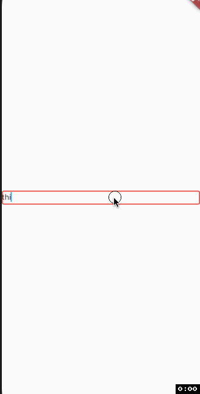

# responsive_text_field

A Flutter plugin to create ResponsiveTextField that auto resizes itself based on the input.
It will increase its maxLines when the text overflows and decreases its maxLines when the text underflow.
####Note: Provide a well calculated width to the widget after subtracting all the paddings and margins for it to work as expected.
## Example
You can just use it the same way you would use a TextField with just four required parameters:
* minLines
* maxLines
* style
* availableWidth

Like the example below:
```dart
class Home extends StatelessWidget {
  @override
  Widget build(BuildContext context) {
    return Center(
      child: ResponsiveTextField(
        availableWidth: MediaQuery.of(context).size.width,
        minLines: 1,
        maxLines: 5,
        style: TextStyle(
          fontSize: 16
        ),
      ),
    );
  }
}
```
### Demo

